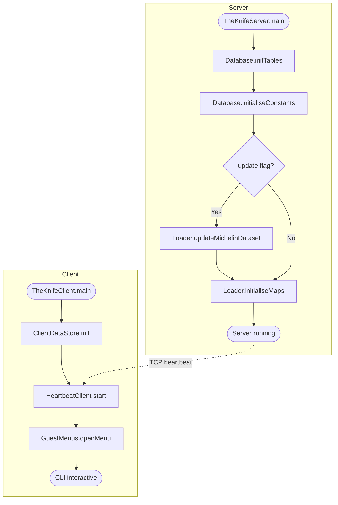
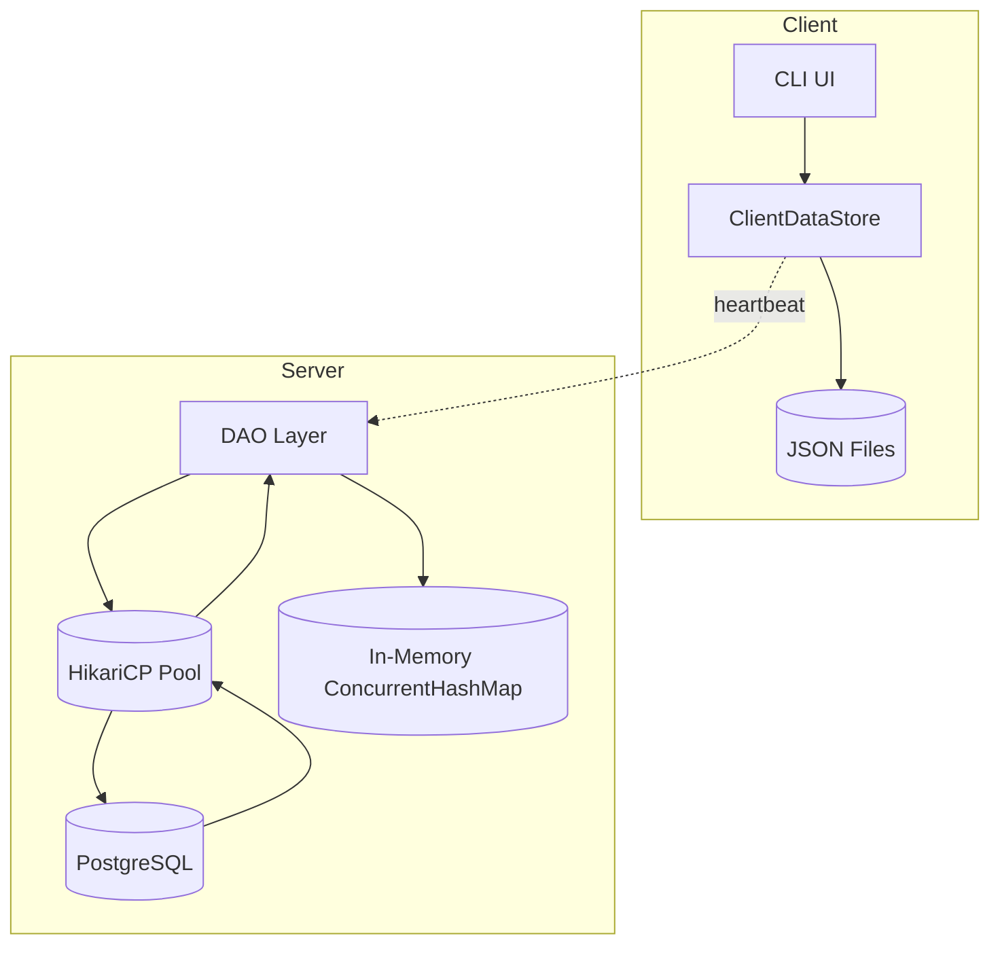
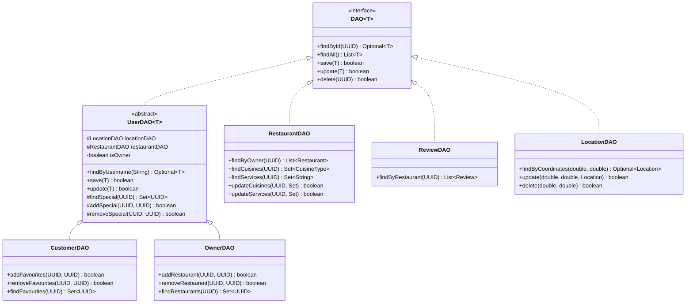
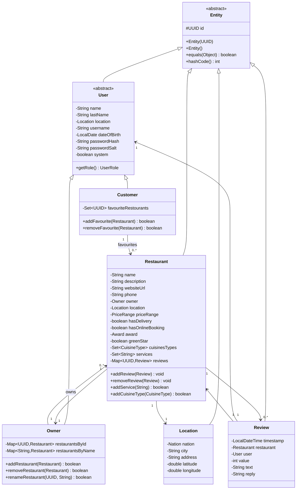
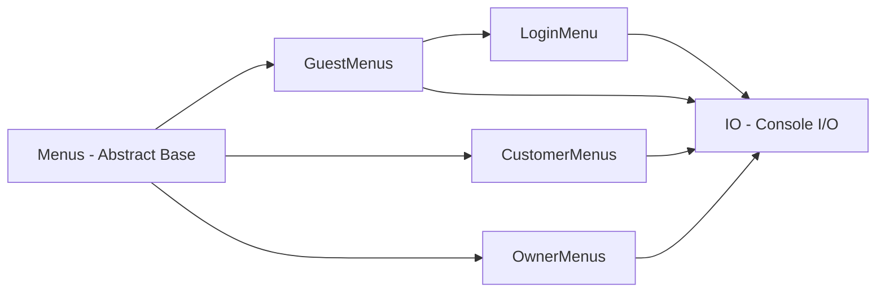
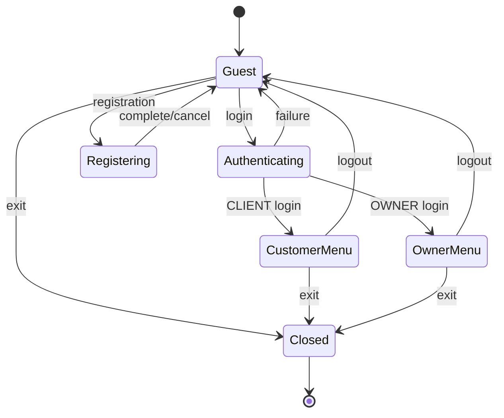
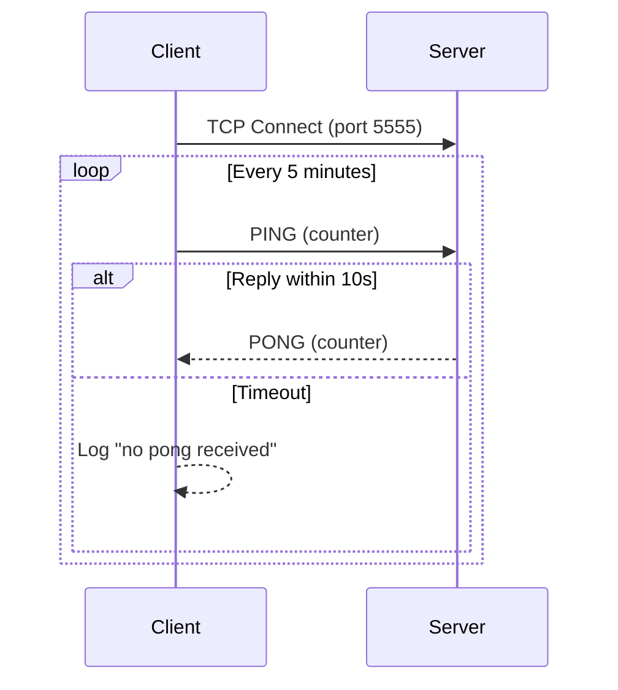
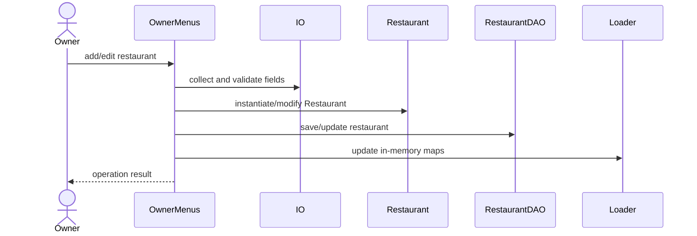
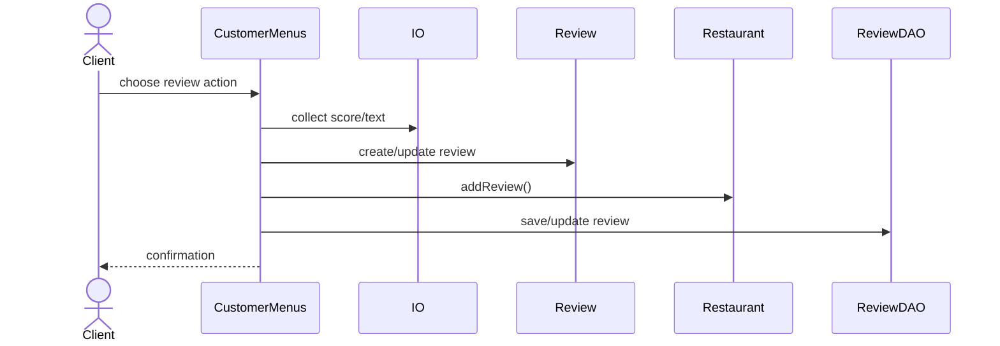
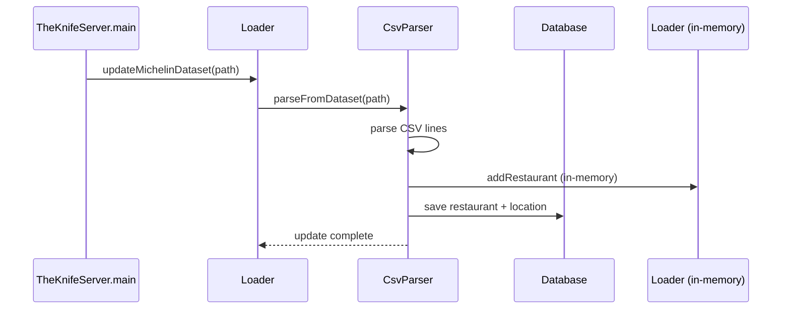

# The Knife Project — Technical Documentation

## 1. Introduction
The Knife is a Java CLI system for Michelin restaurant discovery and management. It uses a client-server architecture with PostgreSQL for server-side persistence, JSON-based local caching on the client, and a TCP heartbeat mechanism for connection monitoring. The shared domain model lives in `common-api`, with separate `app-server` and `app-client` modules.

---

## 2. Project Structure

The project is organized as a Maven multi-module build with the following modules:

| Module | Artifact ID | Role |
|--------|------------|------|
| `common-api` | `theknifeapi` | Shared domain model, enums, validators, DAO interface, heartbeat channel |
| `app-server` | `theknifeserver` | Server-side: PostgreSQL persistence, data loading, CSV import, heartbeat server |
| `app-client` | `theknifeclient` | Client-side: CLI UI, JSON-based local DAOs, heartbeat client |

**Note:** Both `app-server` and `app-client` produce fat JARs via `maven-shade-plugin`, relocating `common-api` and `libphonenumber` packages.

### Module Dependency Graph
```
common-api (theknifeapi)
    ^
    |--- app-server (theknifeserver) + HikariCP + PostgreSQL driver + SLF4J
    |--- app-client (theknifeclient) + Jackson (databind + core)
```

---

## 3. Runtime Entry Points

### 3.1 Server Entry Point: `TheKnifeServer`

**File:** `app-server/src/main/java/it/uninsubria/laboratoriob/server/TheKnifeServer.java`

Responsibilities:
- Start TCP heartbeat server on port 5555.
- Initialize database tables and constant data via `Database.initTables()` and `Database.initialiseConstants()`.
- Optionally run Michelin dataset update with `--update [path]`.
- Load in-memory data from PostgreSQL via `Loader.initialiseMaps()`.

### 3.2 Client Entry Point: `TheKnifeClient`

**File:** `app-client/src/main/java/it/uninsubria/laboratoriob/client/TheKnifeClient.java`

Responsibilities:
- Initialize `ClientDataStore` (JSON-based local DAOs).
- Start `HeartbeatClient` connection to server on port 5555.
- Open `GuestMenus` as the initial UI.

### Diagram: Startup Activity Flow


---

## 4. Persistence Layer

The persistence layer uses PostgreSQL on the server side with HikariCP connection pooling. The client maintains a local JSON-based cache of data.

### 4.1 Database Schema

The schema is defined in `sql/create.sql` and consists of:

| Table | Purpose | Key |
|-------|---------|-----|
| `price_range` | Price tier lookup (economy, moderate, expensive, luxury) | `id INT PK` |
| `awards` | Michelin award lookup (none, stars, Bib Gourmand, etc.) | `id INT PK` |
| `cuisine_type` | Cuisine type lookup (249 types) | `id INT PK` |
| `services_and_facilities` | Service/facility lookup (WiFi, Parking, etc.) | `id INT PK` |
| `location` | Geographic locations | `(latitude, longitude) PK` |
| `"user"` | Users (both customers and owners) | `UUID PK` |
| `restaurant` | Restaurants | `UUID PK` |
| `user_favorites` | Customer → Restaurant favorites (many-to-many) | `(user_id, restaurant_id) PK` |
| `user_restaurants` | Owner → Restaurant ownership (many-to-many) | `(user_id, restaurant_id) PK` |
| `restaurant_cuisine` | Restaurant → Cuisine type (many-to-many) | `(restaurant_id, type) PK` |
| `restaurant_services` | Restaurant → Service (many-to-many) | `(restaurant_id, service) PK` |
| `review` | Reviews (one per user per restaurant) | `UUID PK`, `UNIQUE(user_id, restaurant_id)` |

### 4.2 Connection Pool (HikariCP)

Configured in `Database.java` (server):
- Max pool size: 10 connections
- Connection timeout: 30 seconds
- Min idle: 2 connections
- PreparedStatement cache: 250 entries, max 2048 bytes

### 4.3 Client-Side JSON Storage

The client persists data locally using Jackson `ObjectMapper` with the following files:

| File | Entity | DAO Class |
|------|--------|-----------|
| `data/customers.json` | Customer | `JsonCustomerDAO` |
| `data/owners.json` | Owner | `JsonOwnerDAO` |
| `data/restaurants.json` | Restaurant | `JsonRestaurantDAO` |
| `data/reviews.json` | Review | `JsonReviewDAO` |
| `data/locations.json` | Location | `JsonLocationDAO` |

The `ClientDataStore` facade orchestrates all JSON DAOs and is designed to be easily replaceable with an RMI implementation in the future.

### Diagram: Persistence Component Diagram


---

## 5. Data Access Objects (DAO)

All DAOs implement the generic `DAO<T>` interface defined in `common-api`:

```java
public interface DAO<T> {
    Optional<T> findById(UUID id);
    List<T> findAll();
    boolean save(T entity);
    boolean update(T entity);
    boolean delete(UUID id);
}
```

### 5.1 Server-Side DAO Hierarchy (JDBC)


### 5.2 Client-Side DAO Hierarchy (JSON)

| DAO Class | Storage File | Description |
|-----------|-------------|-------------|
| `JsonCustomerDAO` | `data/customers.json` | Customer CRUD via Jackson |
| `JsonOwnerDAO` | `data/owners.json` | Owner CRUD via Jackson |
| `JsonRestaurantDAO` | `data/restaurants.json` | Restaurant CRUD via Jackson |
| `JsonReviewDAO` | `data/reviews.json` | Review CRUD via Jackson |
| `JsonLocationDAO` | `data/locations.json` | Location CRUD via Jackson |

---

## 6. Domain Model

The domain model is defined in the `common-api` module and shared across all modules.

### Entity Hierarchy


### Key Enums
| Enum | Values | Purpose |
|------|--------|---------|
| `UserRole` | `CLIENT`, `OWNER` | Distinguishes user capabilities |
| `Award` | `NONE`, `ONE_STAR`, `TWO_STARS`, `THREE_STARS`, `BIB_GOURMAND`, `SELECTED_RESTAURANTS` | Michelin recognition levels |
| `PriceRange` | `ECONOMY`, `MODERATE`, `EXPENSIVE`, `LUXURY` | Price tier classification |
| `CuisineType` | 249 values | Cuisine categories from around the world |
| `Nation` | ~70 values | Supported countries with ISO codes |

---

## 7. Security

### Password Hashing
Passwords are hashed using PBKDF2 with HMAC-SHA256 via `PasswordHasher` (server-side):
- Salt length: 16 bytes (random via `SecureRandom`)
- Iterations: 10,000
- Key length: 256 bits
- Encoding: Base64

### Authentication Flow
1. User provides username and password.
2. System retrieves stored hash and salt from database.
3. `PasswordHasher.verify()` compares the attempted password hash with the stored hash.
4. Maximum 4 login attempts before session termination.

**Note:** Client-side password verification is currently bypassed (commented out in `LoginMenu`). Authentication is handled by comparing password hashes directly in `TheKnifeClient.loginCustomer()`/`loginOwner()`.

---

## 8. User Interface and Navigation Layer

The CLI interface is implemented in the `app-client` module under `it.uninsubria.laboratoriob.client.ui`.

### UI Component Hierarchy


### Navigation Flow


---

## 9. Heartbeat Mechanism

The project implements a TCP heartbeat for connection monitoring between client and server.

### Components

| Component | Module | Role |
|-----------|--------|------|
| `HeartbeatChannel` | `common-api` | Shared bidirectional TCP heartbeat protocol (PING/PONG) |
| `HeartbeatServer` | `app-server` | TCP server that accepts a connection and starts `HeartbeatChannel` |
| `HeartbeatClient` | `app-client` | TCP client that connects to server heartbeat |

### Protocol
- **PING** (byte `0`): Sent by pinger, expects PONG response.
- **PONG** (byte `1`): Response to PING.
- Configurable interval (default: 5 minutes).
- 10-second timeout for pong response.
- `wakeUp()` method for immediate check on operation failure.

### Diagram: Heartbeat Sequence


---

## 10. Operational Workflows

### 10.1 Browse and Search Restaurants


### 10.2 Owner Creates/Edits a Restaurant


### 10.3 Client Adds/Edits a Review


### 10.4 Michelin Dataset Update


---

## 11. Utilities

### CsvParser
Parses the Michelin restaurant CSV dataset and persists records to the database and in-memory cache. Handles:
- Robust parsing of irregular CSV fields (addresses, phone numbers, coordinates).
- Normalization of cities, nations, awards, cuisine types, and services.
- Creation of a system owner for imported records.

### Loader
Central in-memory data store with `ConcurrentHashMap` for thread-safe access. Provides:
- Read operations (single entity lookup, bulk unmodifiable views).
- Write operations (add, remove, update for restaurants and users).
- Initialization from database via DAOs using `CompletableFuture` for parallel queries.

### Database
Manages the PostgreSQL connection pool and schema initialization via HikariCP.

### PasswordHasher
PBKDF2-based password hashing utility with configurable parameters.

### IO
Console I/O utility for the client: menu display, validated input (strings, ints, booleans, phone numbers, locations, enums, UUIDs), colored output, screen clearing.

---

## 12. Technology Stack

| Component | Technology | Version | Module |
|-----------|-----------|---------|--------|
| Language | Java | 17+ (server), 25 (client) | all |
| Build | Maven | 3.9.9+ | all |
| Database | PostgreSQL | 18 (Docker) | app-server |
| Database Driver | PostgreSQL JDBC | 42.7.7 | app-server |
| Connection Pool | HikariCP | 7.0.2 | app-server |
| Logging | SLF4J Simple | 2.0.17 | app-server |
| JSON Serialization | Jackson | 2.15.3 | app-client |
| Code Generation | Lombok | 1.18.38 | common-api |
| Phone Validation | libphonenumber | 8.13.27 | common-api |
| Testing | JUnit 5 | 5.10.2 | common-api |

---

## 13. Observations and Improvement Opportunities
- The client uses local JSON files as a data cache; no RMI/RPC layer is implemented yet for server synchronization.
- Server-client communication is limited to the TCP heartbeat — data synchronization is pending.
- Client-side password verification is commented out in `LoginMenu`.
- The client targets Java 25 while the server and common-api target Java 17 — this inconsistency should be resolved.
- `LocationDAO` uses composite primary key (latitude, longitude) instead of a UUID, which is non-standard compared to other entities.
- `CsvParser` creates random lat/lon for locations that lack coordinates — this could be improved with geocoding.
- The in-memory `Loader` caches all data at startup — suitable for the current scale but may need pagination or lazy loading for larger datasets.
- Connection pool credentials are hardcoded in `Database.java` — should be externalized to configuration.
- The `standalone` directory is an orphan with compiled artifacts but no source code — should be removed.
