# The Knife Project — Technical Documentation

## 1. Introduction
The Knife is a Java CLI system for restaurant discovery and management. This document is organized **by application area** so each part (runtime, UI, domain, persistence, operations) has its own explanation and targeted diagrams.

---

## 2. Runtime Entry Point and Bootstrapping
This section describes how the application starts and decides between update-mode and interactive CLI mode.

### Responsibilities
- Parse startup arguments in `TheKnife.main(...)`.
- Optionally run Michelin dataset update.
- Load in-memory data from disk.
- Start guest menu navigation.

### Diagram: Startup Activity Flow
```mermaid
flowchart TD
    A([Start app]) --> B{--update flag?}
    B -- Yes --> C[updateMichelinDataset(path?)]
    C --> Z([Exit])
    B -- No --> D[print "Loading The Knife..."]
    D --> E[Loader.loadFromFile()]
    E --> F[GuestMenus.openMenu()]
    F --> Z
```

### Diagram: Startup Sequence
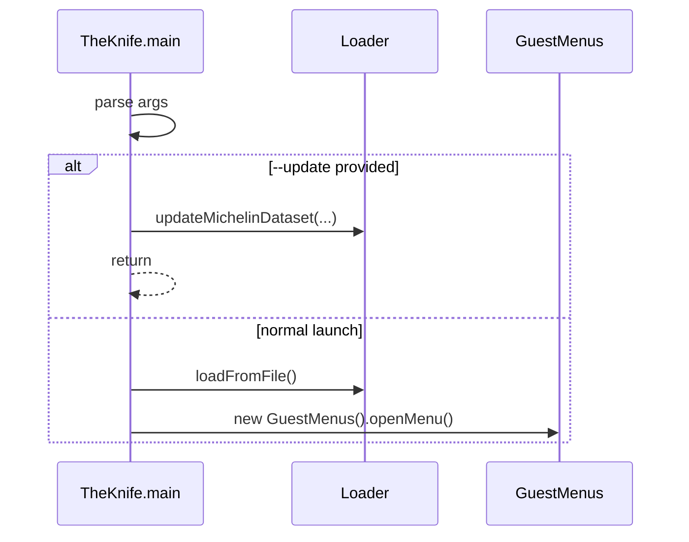

---

## 3. User Interface and Navigation Layer
This section covers CLI interaction components (`IO`, `Menus`, `GuestMenus`, `UserMenus`, `OwnerMenus`, `Login`) and how users traverse the application.

### Responsibilities
- Console I/O, input validation, and menu rendering.
- Role-based navigation and menu branching.
- Authentication and registration workflows.

### Diagram: UI Module Map
```mermaid
flowchart LR
    IO[IO]
    Login[Login]
    Menus[Menus (abstract)]
    Guest[GuestMenus]
    UserM[UserMenus]
    OwnerM[OwnerMenus]

    Menus --> Guest
    Menus --> UserM
    UserM --> OwnerM
    Guest --> Login
    Guest --> IO
    UserM --> IO
    OwnerM --> IO
    Login --> IO
```

### Diagram: Login Sequence
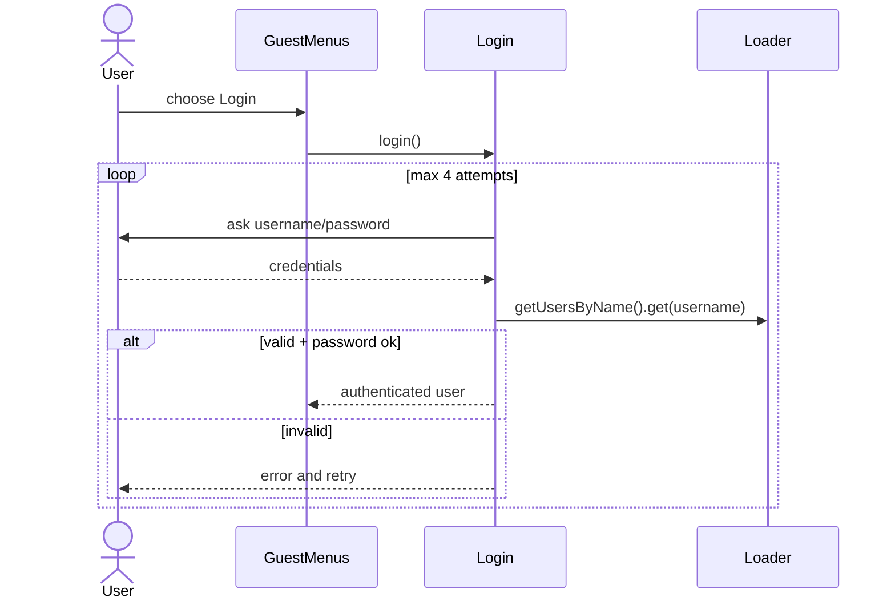

### Diagram: Registration Sequence
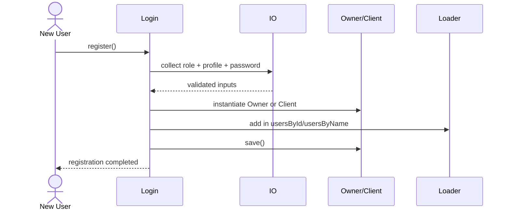

---

## 4. Domain Model (Entities and Business Relationships)
This section documents the core entities and their relationships.

### Responsibilities
- Represent users, restaurants, reviews, and locations.
- Keep entity data consistent and serializable.
- Support role-specific actions (favorites for clients, management for owners).

### Diagram: Domain Class Diagram
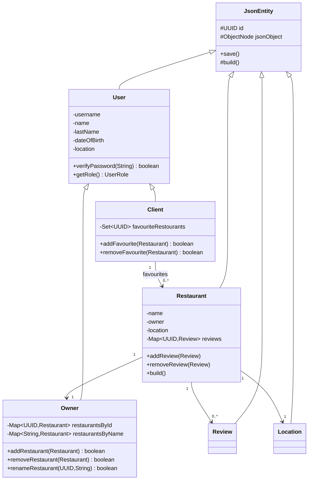

### Diagram: Restaurant Lifecycle State Machine
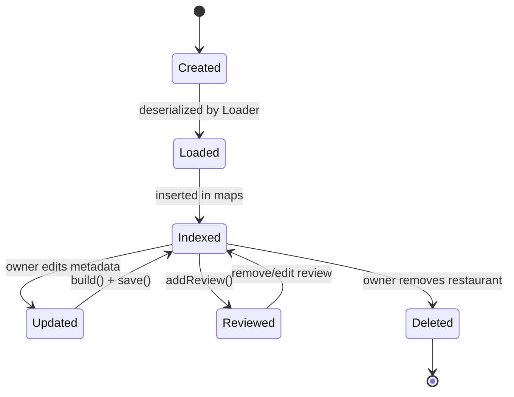

---

## 5. Persistence and Data Management
This section explains file-backed persistence and runtime indexing via `Loader` and `JsonEntity`.

### Responsibilities
- Load users/restaurants from JSON files.
- Maintain fast lookup indexes by ID and name.
- Persist updated entities back to filesystem.

### Diagram: Persistence Component Diagram
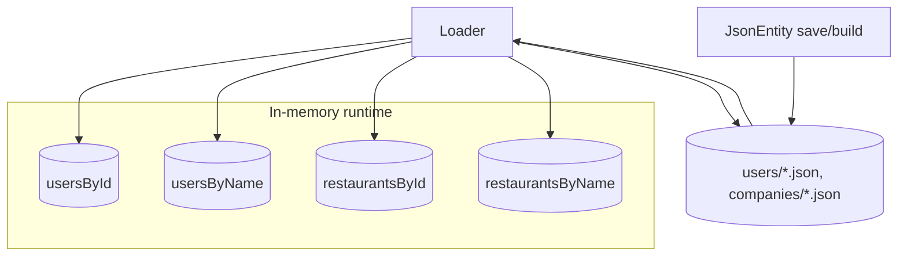

### Diagram: Data Load Sequence
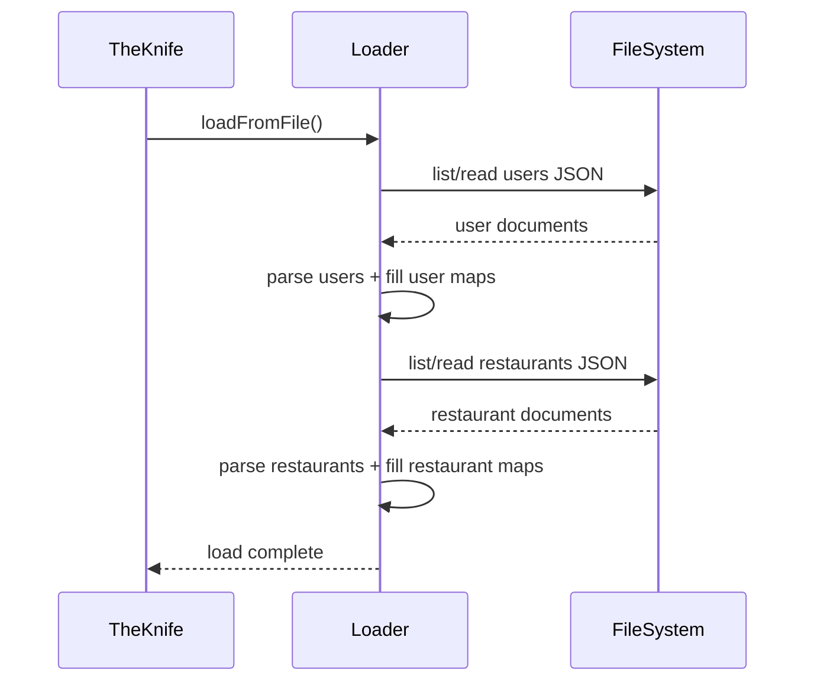

---

## 6. Operational Workflows
This section isolates the most common day-to-day user operations.

### 6.1 Browse and Search Restaurants
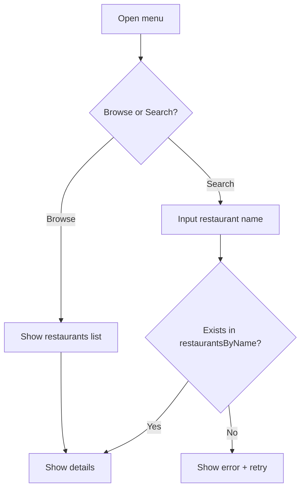

### 6.2 Owner Creates a Restaurant
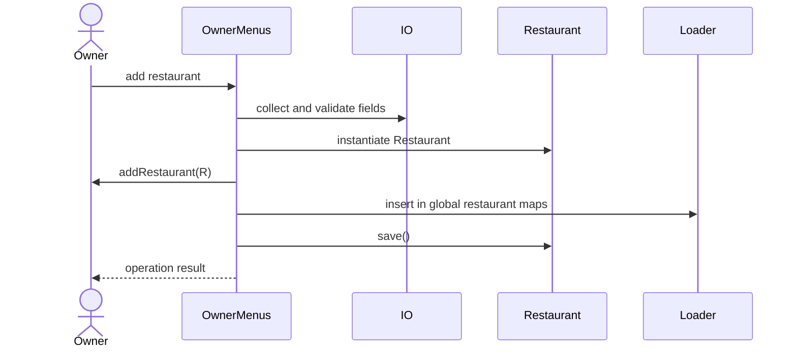

### 6.3 Client Adds/Edits a Review
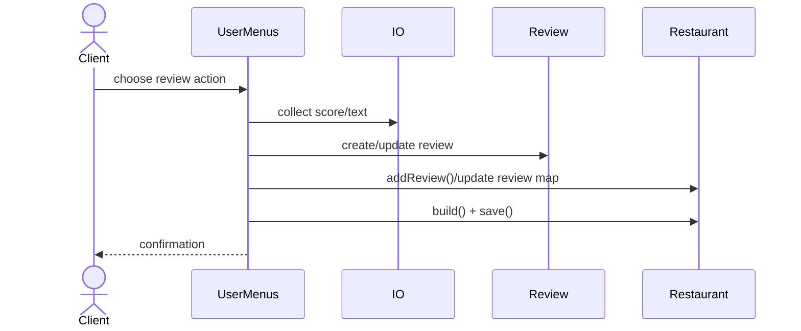

### 6.4 User Session State
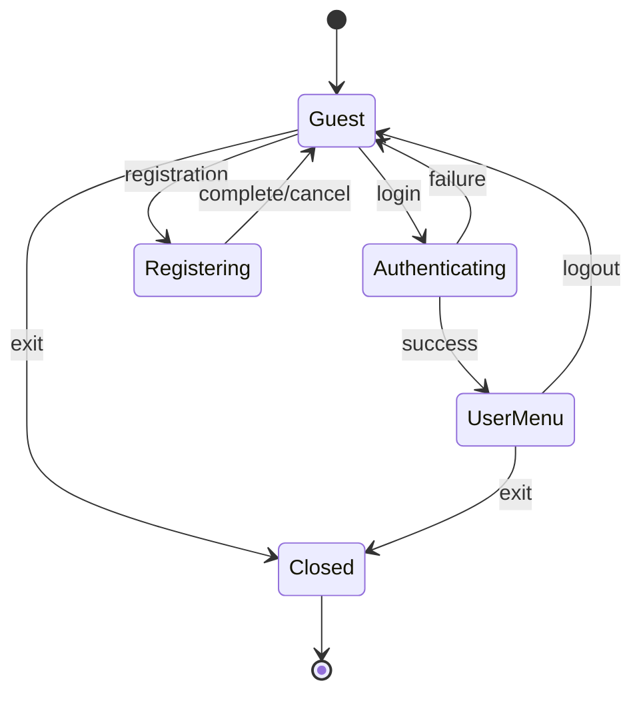

---

## 7. Consolidated Use Case View
This is the cross-section view that connects all roles with supported capabilities.

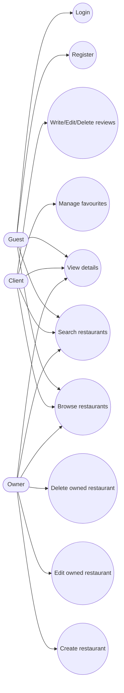

---

## 8. Observations and Improvement Opportunities
- The current approach is simple and effective for a CLI project: in-memory maps + JSON file persistence.
- Domain objects are tightly coupled to serialization (`build()` pattern), which simplifies persistence but couples concerns.
- `Loader` static state is convenient but reduces testability and dependency control.
- A natural evolution path is introducing explicit service/repository layers and integration tests for end-to-end CLI scenarios.
