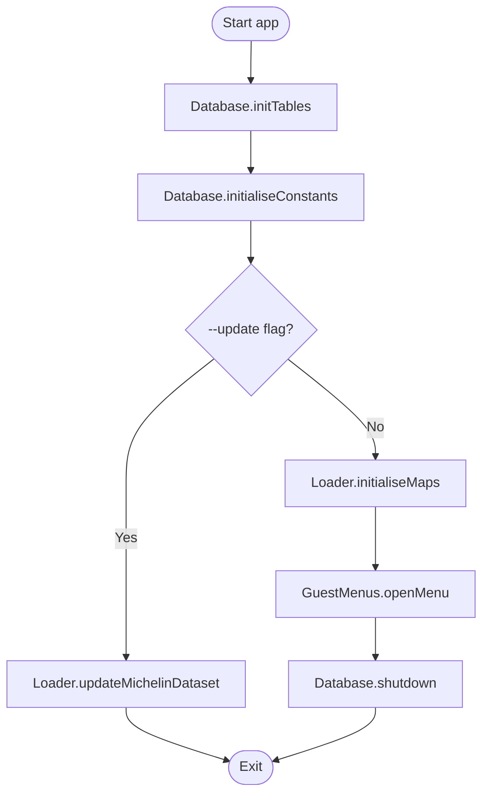
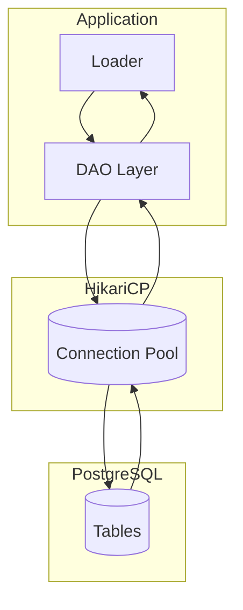
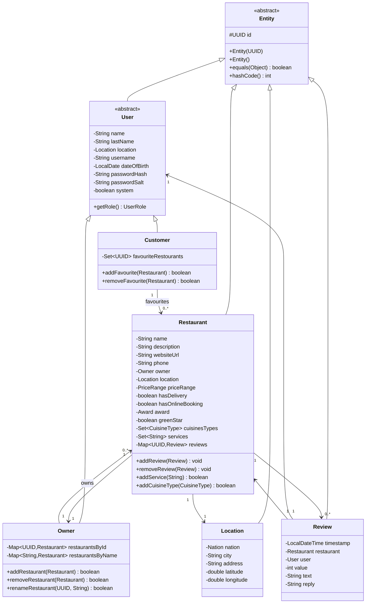
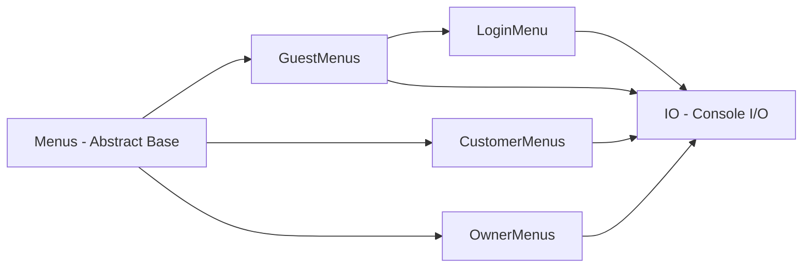
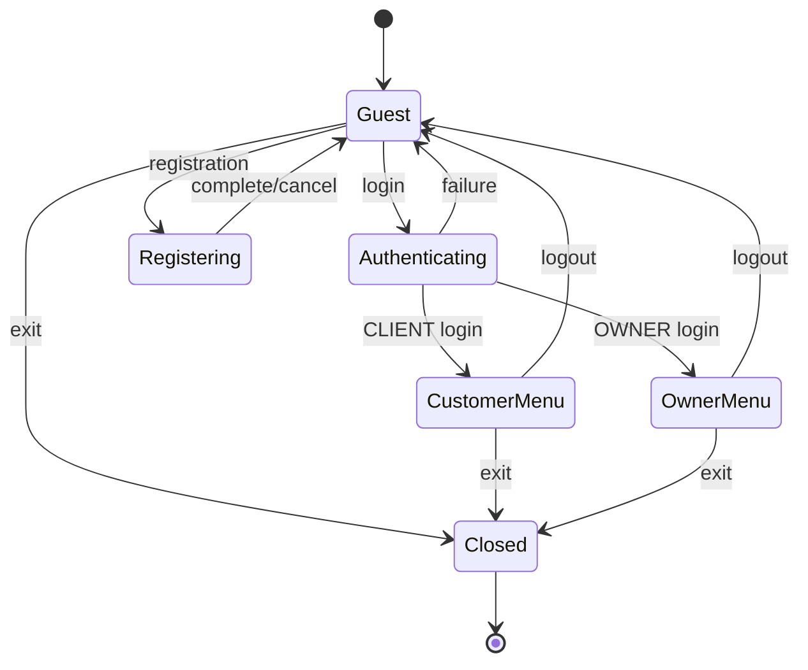
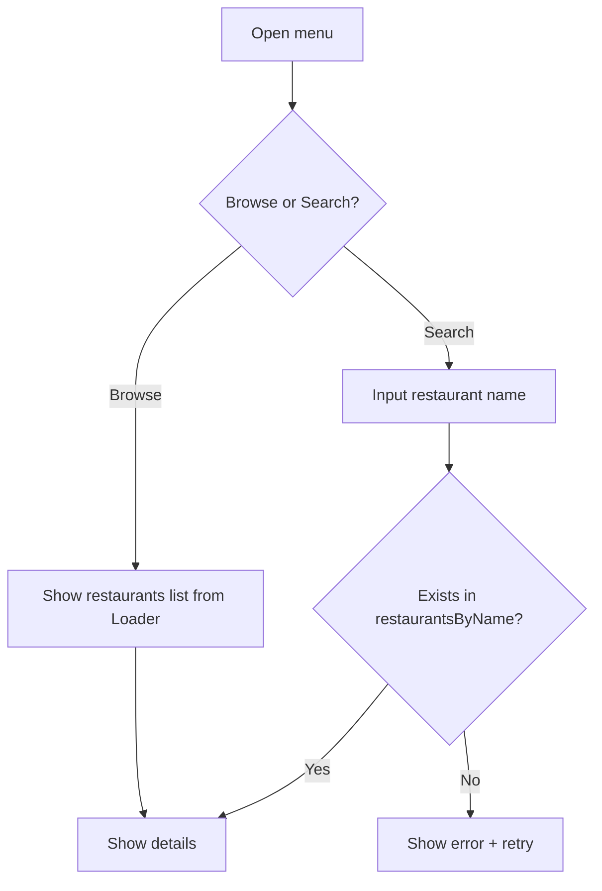
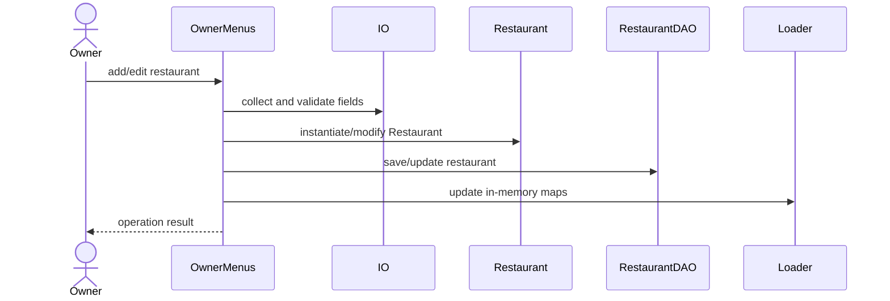
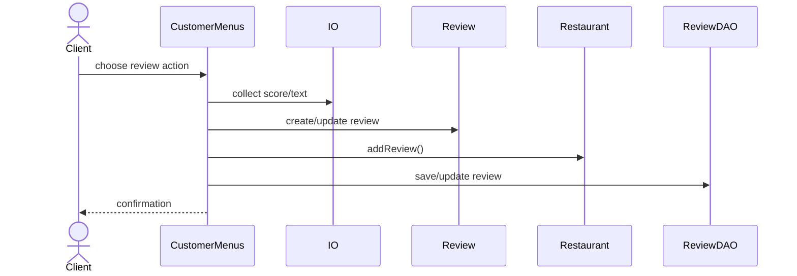
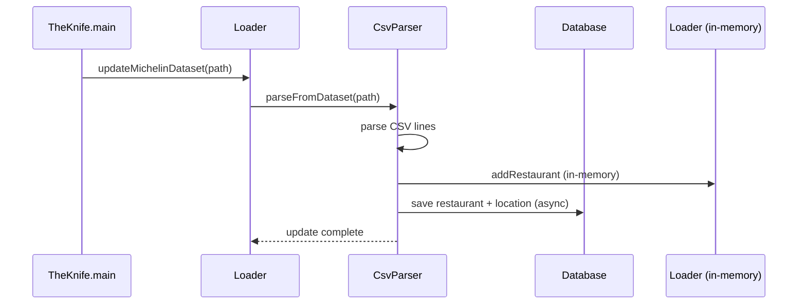

# The Knife Project — Technical Documentation

## 1. Introduction
The Knife is a Java CLI system for restaurant discovery and management. It uses PostgreSQL for persistence, HikariCP for connection pooling, and a modular architecture with a shared domain API (`common-api`), a standalone executable module, and placeholder client/server modules for future expansion.

---

## 2. Project Structure

The project is organized as a Maven multi-module build with the following modules:

| Module | Artifact ID | Role |
|--------|------------|------|
| `common-api` | `theknifeapi` | Shared domain model, enums, validators, DAO interface |
| `standalone` | `standalone` | Executable CLI application (fat JAR via maven-shade-plugin) |
| `app-server` | `theknifeserver` | Placeholder for future server module |
| `app-client` | `theknifeclient` | Placeholder for future client module |

**Note:** The `standalone` module is treated as an executable (like `app-server`/`app-client`), not as a library module. It produces a self-contained JAR with all dependencies shaded and relocated.

### Module Dependency Graph
```
common-api (theknifeapi)
    ^
    |
standalone (depends on theknifeapi + HikariCP + PostgreSQL driver + SLF4J)
```

---

## 3. Runtime Entry Point and Bootstrapping

The application starts via `TheKnife.main(...)` in the `standalone` module.

### Responsibilities
- Initialize database tables and constant data via `Database.initTables()` and `Database.initialiseConstants()`.
- Optionally run Michelin dataset update with `--update [path]`.
- Load in-memory data from PostgreSQL via `Loader.initialiseMaps()`.
- Start guest menu navigation.

### Diagram: Startup Activity Flow


---

## 4. Persistence Layer

The persistence layer has been migrated from file-based JSON storage to a PostgreSQL relational database with HikariCP connection pooling.

### Database Schema

The schema is defined in `Database.initTables()` and consists of:

| Table | Purpose | Key |
|-------|---------|-----|
| `price_range` | Price tier lookup (economy, moderate, expensive, luxury) | `id INT PK` |
| `awards` | Michelin award lookup (none, stars, Bib Gourmand, etc.) | `id INT PK` |
| `cuisine_type` | Cuisine type lookup (249 types) | `id INT PK` |
| `services_and_facilities` | Service/facility lookup (WiFi, Parking, etc.) | `id INT PK` |
| `location` | Geographic locations | `(latitude, longitude) PK` |
| `"user"` | Users (both customers and owners) | `UUID PK` |
| `restaurant` | Restaurants | `UUID PK` |
| `user_favorites` | Customer → Restaurant favorites (many-to-many) | `(user_id, restaurant_id) PK` |
| `user_restaurants` | Owner → Restaurant ownership (many-to-many) | `(user_id, restaurant_id) PK` |
| `restaurant_cuisine` | Restaurant → Cuisine type (many-to-many) | `(restaurant_id, type) PK` |
| `restaurant_services` | Restaurant → Service (many-to-many) | `(restaurant_id, service) PK` |
| `review` | Reviews (one per user per restaurant) | `UUID PK`, `UNIQUE(user_id, restaurant_id)` |

### Connection Pool (HikariCP)

Configured in `Database`:
- Max pool size: 10 connections
- Connection timeout: 30 seconds
- Min idle: 2 connections
- PreparedStatement cache: 250 entries, max 2048 bytes

### Diagram: Persistence Component Diagram


---

## 5. Data Access Objects (DAO)

All DAOs implement the generic `DAO<T>` interface defined in `common-api`:

```java
public interface DAO<T> {
    Optional<T> findById(UUID id);
    List<T> findAll();
    boolean save(T entity);
    boolean update(T entity);
    boolean delete(UUID id);
}
```

### DAO Hierarchy


---

## 6. Domain Model

The domain model is defined in the `common-api` module and shared across all modules.

### Entity Hierarchy


### Key Enums
| Enum | Values | Purpose |
|------|--------|---------|
| `UserRole` | `CLIENT`, `OWNER` | Distinguishes user capabilities |
| `Award` | `NONE`, `ONE_STAR`, `TWO_STARS`, `THREE_STARS`, `BIB_GOURMAND`, `SELECTED_RESTAURANTS` | Michelin recognition levels |
| `PriceRange` | `ECONOMY`, `MODERATE`, `EXPENSIVE`, `LUXURY` | Price tier classification |
| `CuisineType` | 249 values | Cuisine categories from around the world |
| `Nation` | ~100 values | Supported countries with ISO codes |

---

## 7. Security

### Password Hashing
Passwords are hashed using PBKDF2 with HMAC-SHA256 via `PasswordHasher`:
- Salt length: 16 bytes (random via `SecureRandom`)
- Iterations: 10,000
- Key length: 256 bits
- Encoding: Base64

### Authentication Flow
1. User provides username and password.
2. System retrieves stored hash and salt from database.
3. `PasswordHasher.verify()` compares the attempted password hash with the stored hash.
4. Maximum 4 login attempts before session termination.

---

## 8. User Interface and Navigation Layer

The CLI interface is implemented in the `standalone` module under `it.uninsubria.laboratoriob.ui`.

### UI Component Hierarchy


### Navigation Flow


---

## 9. Operational Workflows

### 9.1 Browse and Search Restaurants


### 9.2 Owner Creates/Edits a Restaurant


### 9.3 Client Adds/Edits a Review


### 9.4 Michelin Dataset Update


---

## 10. Utilities

### CsvParser
Parses the Michelin restaurant CSV dataset and persists records to the database and in-memory cache. Handles:
- Robust parsing of irregular CSV fields (addresses, phone numbers, coordinates).
- Normalization of cities, nations, awards, cuisine types, and services.
- Creation of a system owner for imported records.

### Loader
Central in-memory data store with `ConcurrentHashMap` for thread-safe access. Provides:
- Read operations (single entity lookup, bulk unmodifiable views).
- Write operations (add, remove, update for restaurants and users).
- Initialization from database via DAOs.

### Database
Manages the PostgreSQL connection pool and schema initialization via HikariCP.

### PasswordHasher
PBKDF2-based password hashing utility with configurable parameters.

---

## 11. Technology Stack

| Component | Technology | Version |
|-----------|-----------|---------|
| Language | Java | 17+ |
| Build | Maven | 3.9.9+ |
| Database | PostgreSQL | 42.7.7 (driver) |
| Connection Pool | HikariCP | 7.0.2 |
| Logging | SLF4J Simple | 2.0.17 |
| Code Generation | Lombok | 1.18.38 |
| Phone Validation | libphonenumber | 8.13.27 |
| Testing | JUnit 5 | 5.10.2 |

---

## 12. Observations and Improvement Opportunities
- The `standalone` module is the current executable; `app-server` and `app-client` are placeholders for future client-server architecture.
- The `UserDAO` uses a boolean `isOwner` flag to distinguish user types in the same table — a potential refactor to separate tables or use inheritance mapping.
- `LocationDAO` uses composite primary key (latitude, longitude) instead of a UUID, which is non-standard compared to other entities.
- `CsvParser` creates random lat/lon for locations that lack coordinates — this could be improved with geocoding.
- The in-memory `Loader` caches all data at startup — suitable for the current scale but may need pagination or lazy loading for larger datasets.
- Connection pool credentials are hardcoded in `Database.java` — should be externalized to configuration.
